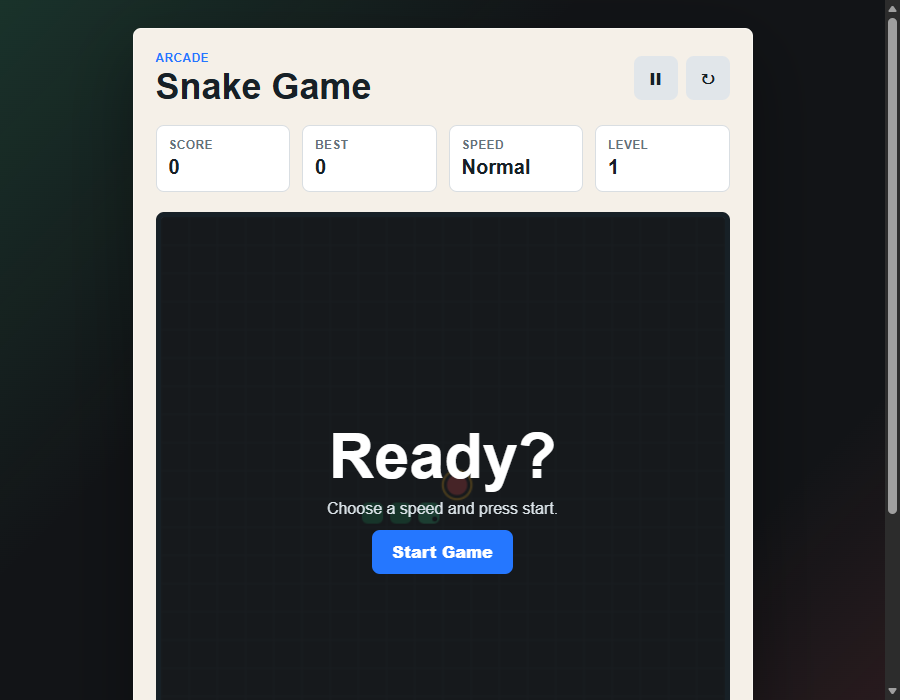

# Snake Game

A responsive browser-based Snake arcade game built with HTML, CSS, and JavaScript.

## Live Demo

**[Play Now on GitHub Pages](https://sriram127.github.io/Snake_Game/)**

[](https://sriram127.github.io/Snake_Game/)

## Screenshot



## Features

- Classic Snake gameplay on a canvas board
- Easy, Normal, and Hard speed modes
- Score, best score, speed, and level panels
- Best score saved with `localStorage`
- Pause and restart controls
- Optional wall-wrap mode (snake passes through edges)
- Optional sound effects
- Keyboard controls for desktop
- Touch swipe controls for mobile
- Responsive layout for all screen sizes

## Tech Stack

- HTML5 Canvas
- CSS3
- Vanilla JavaScript

## Run Locally

Open `index.html` directly in any browser, or start a local server:

```bash
python -m http.server 8010
```

Then open `http://127.0.0.1:8010/` in your browser.

## How To Play

1. Choose a speed mode (Easy / Normal / Hard).
2. Press **Start Game**.
3. Use arrow keys or `W` `A` `S` `D` to steer the snake.
4. Eat the red food to grow and earn points.
5. Avoid hitting walls or your own body.
6. Enable **Wrap walls** to let the snake pass through edges.

## Controls

| Action | Keyboard |
|---|---|
| Move up | `ArrowUp` / `W` |
| Move left | `ArrowLeft` / `A` |
| Move down | `ArrowDown` / `S` |
| Move right | `ArrowRight` / `D` |
| Pause | `P` |

Mobile: swipe in any direction to steer.

## Project Structure

```text
Snake_Game/
├── index.html
├── style.css
├── script.js
├── screenshot.png
├── README.md
└── .gitignore
```

## Deployment

This repository is automatically deployed to **GitHub Pages** via GitHub Actions on every push to `main`/`master`. The workflow file is at `.github/workflows/deploy.yml`.
